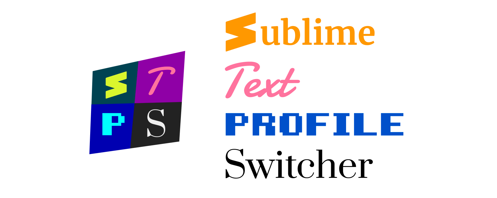

# Profile Switcher for Sublime Text




## Problem

Code is best viewed in a narrow, tight font, with syntax highlighting, line numbers etc.

Prose writing is best done in wide font, generous line spacing, dim colors, width-limited column. 

Sublime Text is great for both, but changing settings back and forth quickly becomes teduious.

Meet Profiles! Save all the settings you’ve changed at once and quickly return to them when needed.

## Installation

`Package Control: Install Package` → `Profile Switcher`.

## Usage


Create a  new profile via `Profiles: Create Profile` command.


Edit your Sublime Text settings as usual.

Switch back to previous profile via `Profiles: Switch Profile`.


Bind a key to `Profiles: Toggle Last Used Profile` to switch even more quickly:

```
{ "keys": ["ctrl+w"], "command": "toggle_profile"}
```

## Features 

- Each profile remembers all the settings: font, scheme, line metrics, gutter, etc.
- Any number of profiles.
- Instant switching.
- Minimal (“automagical”) UI.

## How does it work?

Profiles maintain a copy of `Preferences.sublime-settings`, one per profile.

When switching to the profile, current `Preferences.sublime-settings` is saved, and profile version is copied over current `Preferences.sublime-settings`.

Inactive profiles are stored in `~/Library/Application Support/Sublime Text/Packages/sublime-profiles`.

## See also

[Writer Color Scheme](https://github.com/tonsky/sublime-scheme-writer): A color scheme optimized for long-form writing.

[Alabaster Color Scheme](https://github.com/tonsky/sublime-scheme-alabaster): Minimal color scheme for coding.

[Fira Code](https://github.com/tonsky/FiraCode/): Best coding font in the world.

## Credits

Made by [Niki Tonsky](https://twitter.com/nikitonsky).

## License

[MIT License](./LICENSE.txt)